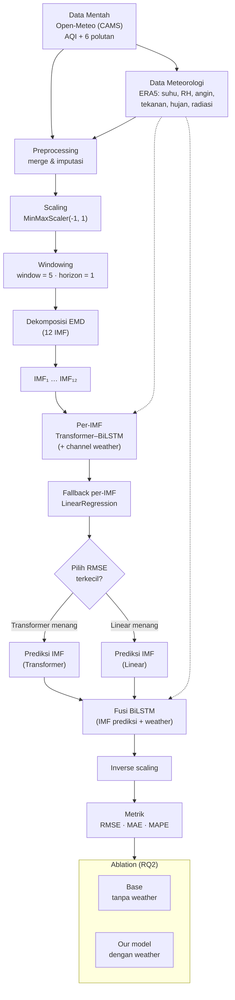

# Diagram Alur — EMD–Transformer–BiLSTM + Weather (Jakarta)

Render: paste ke https://mermaid.live → export PNG/SVG, atau `mmdc -i diagram_alur.md -o flowchart.png`.

## Ringkasan alur

1. **Data**: `fetch_data.py` (Open-Meteo CAMS + ERA5) → `our_data/`.
2. **Preprocessing**: `data.py` — merge, MinMaxScaler(-1,1), windowing (win=5, h=1).
3. **Dekomposisi**: `EMD(max_imf=12)` → 12 IMF.
4. **Per-IMF**: `model.TransAm(n_exog)` (Transformer–BiLSTM) vs `LinearRegression`; RMSE terkecil dipakai (proteksi rujukan).
5. **Fusi**: `model.LstmRNN` (BiLSTM) atas IMF prediksi + weather → AQI.
6. **Evaluasi**: inverse-scale → RMSE / MAE / MAPE.
7. **Ablation**: `--weather` vs base (`train.py`).